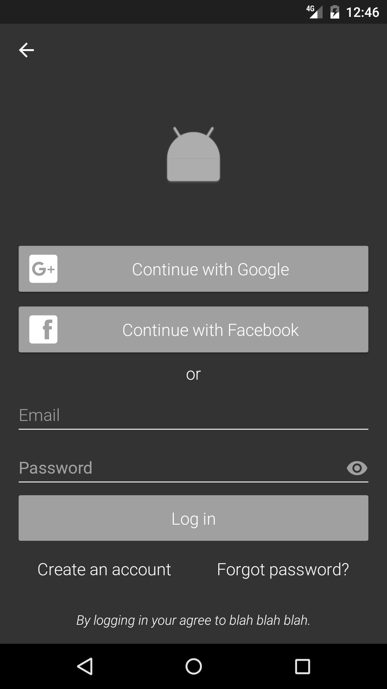

# LoginLayout

Drop in layout element that implements common UI login patterns.  Features include:

1. Login with email and password
2. Create account from email and password
3. Reset password from email
4. Save and auto-fill email/password with SmartLock
5. Login with Google
6. Login with Facebook
7. Login with email only (no password)

## Usage

Add the layout element to any activity layout file:

    <com.vml.login.LoginLayout
        android:layout_width="match_parent"
        android:layout_height="wrap_content"
        android:id="@+id/login_view"
        app:showFacebookLogin="false"
        app:showPasswordLogin="true"
        app:showGoogleLogin="false"
        app:showSmartLock="true"/>
    
    
In your activity's onCreate method, find your LoginLayout and set a FormListener:

    LoginLayout loginLayout = (LoginLayout) findViewById(R.id.login_view);

    loginLayout.setFormListener(new FormListener() {
        @Override
        public void onLoginFormSubmitted(String email, String password) {
            //do custom authentication here, then...
            loginLayout.loginSucceeded(new LoginData(...));
        }

        @Override
        public void onCreateAccountFormSubmitted(String email, String password) {
            //create account
            //log user in
            loginLayout.loginSucceeded(new LoginData(...));
        }

        @Override
        public void onForgotPasswordFormSubmitted(String email) {
            //send password reset email
        }

        @Override
        public boolean onViewCreateAccountButtonClicked() {
            return false;
        }

        @Override
        public boolean onViewForgotPasswordButtonClicked() {
            return false;
        }

        @Override
        public void onLoginCompleted(LoginData loginData) {
            LoginDataStore.of(getApplicationContext()).put(loginData);
            finish();
        }
    });

Then add the following hooks to your activity's lifecycle methods:

    @Override
    protected void onDestroy() {
        loginLayout.onDestroy();
        super.onDestroy();
    }

    @Override
    protected void onActivityResult(int requestCode, int resultCode, Intent data) {
        loginLayout.handleActivityResult(requestCode, resultCode, data);
        super.onActivityResult(requestCode, resultCode, data);
    }

See full examples [here](app/src/main/java/com/sample/login).

License
-------

    Copyright 2016-Present VML

    Licensed under the Apache License, Version 2.0 (the "License");
    you may not use this file except in compliance with the License.
    You may obtain a copy of the License at

       http://www.apache.org/licenses/LICENSE-2.0

    Unless required by applicable law or agreed to in writing, software
    distributed under the License is distributed on an "AS IS" BASIS,
    WITHOUT WARRANTIES OR CONDITIONS OF ANY KIND, either express or implied.
    See the License for the specific language governing permissions and
    limitations under the License.